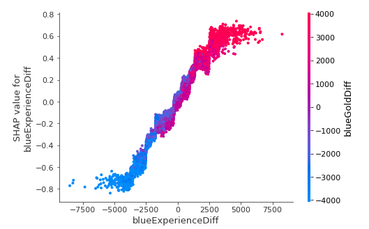
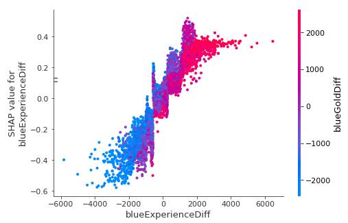
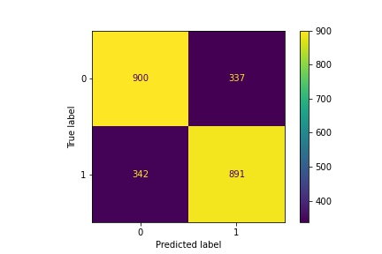
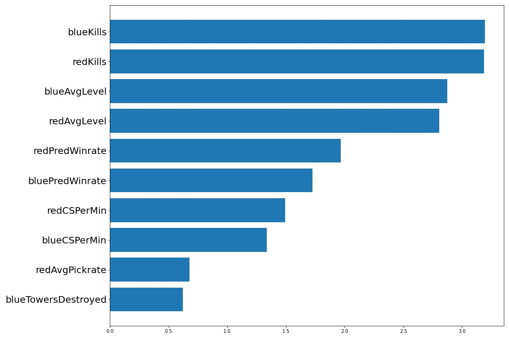
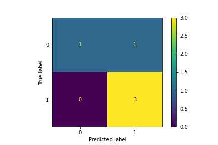
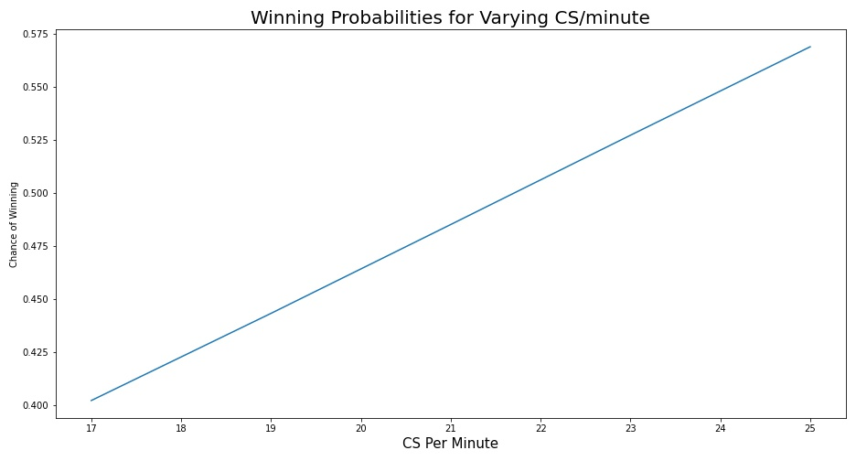
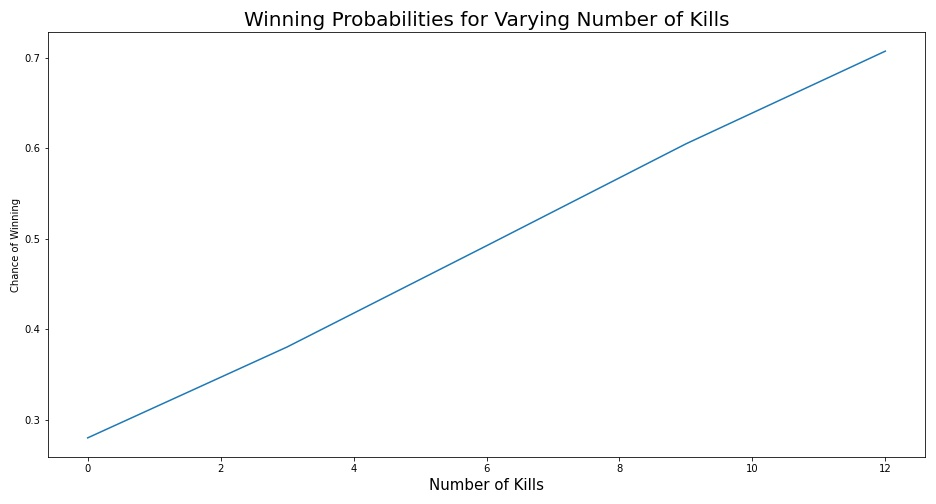

# Predicting League of Legends using 10 minutes of data
by: Andre Yu Tiamco, Jerry Huspeth, and Jacob Hoogstra  
In this project, we used machine learning techniques on a [large dataset](https://www.kaggle.com/bobbyscience/league-of-legends-diamond-ranked-games-10-min) of nearly 10,000 high diamond games in the popular MOBA League of Legends. We also performed similar analysis on a dataset of around 8,000 professional games. The goal was to create a models that, given the first 10 minutes of a given game of LoL, could predict the victor. The results are intended for eventual use in professional and amateur training and practice, as we hope to provide insight into the keys to victory in the early-game strategy of the game.
## Model Results
Using high diamond data, an accuracy of 74% was achieved. Here is a plot generated by the XGBoost model used.


Using the pro data, an accuracy of 69% was achieved. Here is a plot generated by the XGBoost model used.


Using a logistic regression model that was limited to features that would be easy to find whilst in game, the following results were achieved.


This same model had the following most important features (based on size of coefficients).


This same model was used to predict 5 real, recent games at the platinum level. Here is a confusion matrix of the results.


This model was also used to generate the following graphs.


## Conclusion
The models were all able to achieve around 70% accuracy (or higher) using only data from the 10 minute mark.
## Repository Structure
```
archive                       contains various csvs and other files used to finish the project
    processed
    sounds
    
Images                        contains programatically generated images, such as those above

Notebooks                     jupyter notebooks
    Individual                personal work of each individual contributor
        andre
            Data_Handling
            modeling
        jake
            benched
        jerry
        
    final_notebook.ipynb      final notebook for the project
    
Pickles                       useful, pickled objects
snapshots                     images of games of a friend used to test the limited model